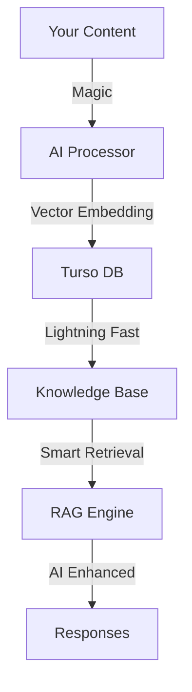

# 🚀 AI-Powered Knowledge Base Platform

[]()
[]()
[]()
[]()

> 🌟 **Supercharge your knowledge base with AI!** Built with Next.js 14, Turso, and a dash of magic ✨

## 🎯 What Makes This Awesome?

### 🎨 Stunning Admin Dashboard
- **Drop-dead Gorgeous UI**: Powered by shadcn/ui + Tailwind CSS
- **Theme Paradise**: 
  - 🎨 Catpuccini vibes
  - ⚡ Supabase sleekness
  - ☕ Caffeine kick
  - 🌙 Night Bourbon elegance
- **Smooth Animations**: Framer Motion goodness
- **Dark/Light Magic**: Seamless theme switching

### 🧠 AI Superpowers
- **Smart Document Processing**: Let AI do the heavy lifting
- **Vector Magic**: Transform documents into searchable knowledge
- **RAG Integration**: Context-aware responses that make sense
- **Multi-Model Support**: Choose your AI champion
  
  #### 🖥️ Local Models (via Ollama)
  - 🚀 **Recommended Models**:
    - Mistral 7B (4.1GB): Fast responses, excellent Dutch support
    - Neural-Chat (4.8GB): Optimized for chat interactions
  
  - 🔄 **Alternative Models**:
    - Llama 2 7B (3.8GB): Meta's latest model, good all-rounder
    - Llama 2 13B (7.3GB): Larger, more capable version
  
  - 🪶 **Lightweight Options**:
    - TinyLlama (1.2GB): Ultra lightweight, perfect for testing
    - Phi-2 (1.7GB): Microsoft's small but mighty model
  
  #### ☁️ Cloud Integration
  - Groq API integration available in admin interface
  - Free credits for new users
  - Configure your API key in settings

### ⚡ Lightning Fast with Turso
- **Edge-Ready Database**: Powered by libSQL
- **Global Distribution**: Your data, everywhere
- **Blazing Performance**: Built for speed
- **Rock-Solid Foundation**: Enterprise-grade reliability

## 🚀 Quick Start

```bash
# Clone this beauty
git clone https://github.com/yourusername/ai-kb
cd ai-kb

# Install dependencies
pnpm install

# Install AI models (interactive)
pnpm run install-models

# Light it up! 🔥
pnpm dev
```

### 📦 Model Installation

The `install-models` script provides an interactive installation experience:

1. View detailed information about available models
2. Select which models to install (space to select, return to confirm)
3. Models are grouped by category:
   - Recommended: Best for most use cases
   - Alternative: Additional powerful options
   - Lightweight: Perfect for testing
4. See size requirements before downloading

> 💡 **Note**: Local models require disk space (1.2GB - 7.3GB each). For testing, start with lightweight options like TinyLlama (1.2GB) or Phi-2 (1.7GB).

> 💡 **Cloud Models**: Groq integration is configured separately in the admin interface under Settings.

## 💪 Tech Stack of Champions

- **Frontend**: 
  - 🔥 Next.js 14 (App Router)
  - ⚛️ React (Latest and Greatest)
  - 📘 TypeScript (Type Safety FTW)
  
- **Styling**: 
  - 🎨 Tailwind CSS
  - 🎭 shadcn/ui (Beautiful Components)
  - ✨ Framer Motion (Smooth Animations)
  
- **Database & AI**: 
  - 🚀 Turso (Edge Database)
  - 🧠 Vector Embeddings (Coming Soon)
  - 🤖 RAG Integration (In Progress)
  - 🎯 Local AI Models via Ollama

- **Development**: 
  - 📦 pnpm (Fast & Efficient)
  - ⚡ Bun (Speed Demon)
  - 🛠️ DrizzleORM (Type-Safe Queries)

## 🌈 Features in the Pipeline

Get hyped for what's coming:
- 🔍 Advanced semantic search
- 📊 Real-time analytics dashboard
- 🤖 Custom AI model integration
- 🔐 Enterprise-grade security
- 📱 Mobile app companion

## 🏗️ Architecture



## 🚀 Performance

Built for speed and scale with:
- ⚡ Edge-ready architecture
- 🌍 Global data distribution
- 🚄 Optimized queries
- 🎯 Smart caching

## 🌟 Coming Soon

We're cooking up some incredible features:
- 📱 Mobile app
- 🔄 Real-time collaboration
- 🎯 Custom AI fine-tuning
- 🌐 API marketplace

## 🛠️ Development Status

- ✅ Admin Dashboard
- ✅ Theme System
- ✅ Turso Integration
- ✅ Model Management
- 🏗️ RAG Implementation
- 🏗️ Vector Search
- 🎯 Analytics (Planned)

---

<p align="center">
  <strong>Built with ❤️ by [remco stoeten](https://github.com/remcostoeten)</strong>
</p>

## Additional information

### Models & Integration

#### Local Models (via Ollama)
The app supports various local models through Ollama:
- **Recommended**:
  - Mistral 7B: Fast responses, excellent Dutch support (4.1GB)
  - Neural-Chat: Optimized for chat interactions (4.8GB)
- **Alternative**:
  - Llama 2 models: Available in 7B and 13B versions
- **Lightweight**:
  - TinyLlama and Phi-2: Perfect for testing (1.2-1.7GB)

#### Cloud Integration
For users who prefer cloud-based inference:
- Configure Groq API key in the admin interface
- Get free credits when signing up
- No additional setup required